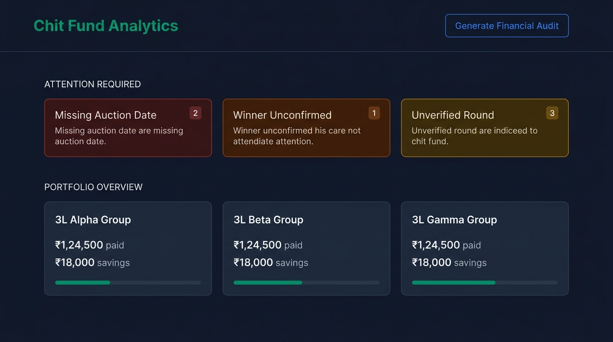
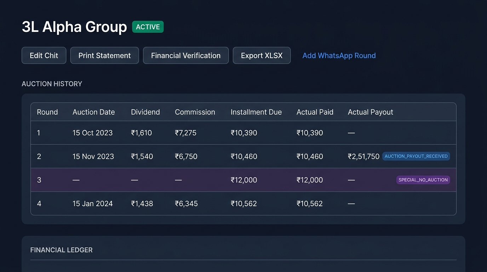

# 💰 Chit Fund Analytics

> A production-ready personal chit-fund tracking, financial verification, cash-flow and analytics platform — designed to replace fragmented manual, WhatsApp, and spreadsheet-based tracking with a strict, append-only financial ledger.

<p align="left">
  <a href="https://chitfund-analytics.vercel.app/"></a>
  
  
  
  
  
</p>

---

## 🔗 Live Application

| Resource | Link |
|---|---|
| 🌐 **Production App** | https://chitfund-analytics.vercel.app/ |
| 📦 **Repository** | https://github.com/Nithish-kumar-git/chitfund-analytics |
| 🏗️ **Architecture** | [docs/ARCHITECTURE.md](docs/ARCHITECTURE.md) |
| 📋 **Historical Spec** | [docs/historical-spec.md](docs/historical-spec.md) |

> 🔐 **Authentication required** — the production application is fully protected. Real financial data is never publicly exposed.

---

## 📸 Screenshots

<table>
  <tr>
    <td align="center"><strong>Command Center Dashboard</strong></td>
    <td align="center"><strong>Chit Round Table</strong></td>
  </tr>
  <tr>
    <td></td>
    <td></td>
  </tr>
  <tr>
    <td align="center"><strong>Financial Verification Queue</strong></td>
    <td align="center"><strong>Architecture Overview</strong></td>
  </tr>
  <tr>
    <td></td>
    <td valign="middle" align="center">
      <pre>
Source Messages
      ↓
Expected Financial State
      ↓
Financial Verification
      ↓
Append-Only Ledger
      ↓
Analytics / Exports
      </pre>
      <em>See <a href="docs/ARCHITECTURE.md">ARCHITECTURE.md</a> for full detail.</em>
    </td>
  </tr>
</table>

> ⚠️ Screenshots use illustrative fictional data. Real production financial information is never published publicly.

---

## ✨ Features

### 📊 Command Center Dashboard
Unified portfolio view: live attention alerts, per-chit cash-flow summaries, installment savings totals, and data-quality warnings — all in one place.

### 🚨 Data Quality / Attention Required
Tiered alert system classifying issues as **Critical** (unknown events, unconfirmed winners, financial mismatches), **Verification** (unverified completed chits), and **Metadata** (missing auction dates). Issues surface immediately before they can corrupt financial records.

### 🛡️ Financial Verification Review Queue
A dedicated per-chit queue for resolving discrepancies between imported source data and mathematically expected values — before anything enters the ledger. Supports four terminal states:

| Status | Meaning |
|---|---|
| `VERIFIED_FORMULA` | Formula calculation confirmed correct |
| `CONFIRM_SOURCE` | Source data explicitly confirmed by user |
| `MANUAL_OVERRIDE` | Discrepancy acknowledged with override |
| `FLAGGED_MISMATCH` | Unresolved discrepancy — blocks ROI |

### 🧾 Append-Only Financial Ledger
Immutable transaction history. Historical entries are **never updated or deleted**. Mistakes are corrected by inserting an explicit overriding entry linked via `corrects_entry_id`, preserving the full audit trail.

### 💰 Installment Savings Tracking
Calculates per-round and cumulative savings from monthly dividends — the difference between the base installment and the discounted payment actually due. Intentionally kept separate from profit and ROI.

### 💵 Actual Payout Recording
Explicit user-triggered flow to record auction payouts received when `won_by_us = true`. Requires a positive amount and an explicit transaction date. Protected by idempotency keys. Creates `AUCTION_PAYOUT_RECEIVED` ledger entries.

### 📈 ROI Safety Gating
Final ROI is strictly guarded. It is never shown for active chits or chits with unresolved verification issues, `FLAGGED_MISMATCH`, or missing rounds. Active chits display **actual cash flow** instead.

### 📅 Auction Date / Payment Date Separation
The auction event date (when the auction happened) and the transaction/payment date (when cash changed hands) are stored and displayed as distinct fields. They are never conflated.

### 🏷️ SPECIAL_NO_AUCTION Handling
Months where no auction occurred (e.g., festive Sangam rounds) are explicitly classified as `SPECIAL_NO_AUCTION`. No thallu, no individual winner, full base installment due. Handled without polluting normal formula checks.

### 🖨️ Printable Chit Statements
A4/browser-print-friendly per-chit statements covering the full round lifecycle, audit-suitable for personal record-keeping.

### 📊 Excel Exports
Per-chit and portfolio-wide XLSX exports with historical round data, actual ledger entries, and financial metrics — suitable for external auditing.

### 🤖 Claude Financial Audit Export
Generates a structured `.md` financial audit payload including portfolio metrics, per-chit summaries, data-quality flags, verification states, and ROI eligibility analysis — optimized for LLM-based review.

### 🔐 Authentication & Privacy
Supabase Auth with Row Level Security (RLS) enforcing per-user data isolation at the database level. No real financial data is publicly accessible.

### 🧪 Automated Testing & CI
518-test Vitest suite covering domain logic, financial calculations, verification states, ledger semantics, and UI components. GitHub Actions CI validates tests, TypeScript, and production build on every push.

---

## 📊 What Is a Chit Fund?

A **chit fund** is a traditional Indian financial instrument combining savings and borrowing. A group of members contributes a fixed base installment every month. Each month, an auction decides who receives the pooled amount at a discount. The discounted amount (the **thallu** or dividend) is distributed equally among all members, reducing their required payment for that round.

Because the required payment fluctuates every month based on auction outcomes, tracking expected payments, actual cash flows, and ROI across multiple chits simultaneously is notoriously difficult to manage manually — which is exactly the problem this application solves.

---

## 🏗️ How It Works

```
Source Messages (WhatsApp round data)
           ↓
  Expected Financial State
  (auction_events: thallu, commission,
   dividend, expected installment)
           ↓
  Financial Verification Review Queue
  (flag mismatches, confirm formula,
   confirm source, manual override)
           ↓
  Append-Only Actual Ledger
  (ledger_entries: INSTALLMENT_PAID,
   AUCTION_PAYOUT_RECEIVED, corrections)
           ↓
  Analytics & Reporting
  (savings, active cash flow, ROI,
   PDF statements, Excel, audit export)
```

See [docs/ARCHITECTURE.md](docs/ARCHITECTURE.md) for full system boundaries, database schema, and design decisions.

---

## 💰 Financial Safety Model

This section summarizes the most important design principles. These are not abstract ideals — they are enforced in code and tested.

### Expected ≠ Actual
The mathematically expected installment for a round is **never automatically treated as an actual payment made**. Only explicit ledger entries created by deliberate user action represent real cash flows.

### Auction Date ≠ Payment Date
The date an auction occurred and the date cash was paid are stored separately and displayed distinctly. They are never conflated in calculations.

### Savings ≠ Profit
Installment savings — the difference between the base installment and the discounted amount due — reduces monthly outflow but does **not** constitute profit. It is tracked separately.

### Active Cash Flow ≠ Profit
Active chits display their actual net cash position — not a projected profit. "Profit" requires maturity, completeness, and verification.

### Mismatches Are Preserved
Financial discrepancies between expected and actual values are never silently corrected. They are flagged as `FLAGGED_MISMATCH` and require explicit human resolution.

### `UNKNOWN` Stays `UNKNOWN`
Missing or ambiguous data is never silently interpolated. Unknown winners, unclassified events, and missing dates remain unknown until explicitly resolved.

### ROI Is Gated
Final ROI is computed only after a chit is marked completed, all rounds are recorded, all verification conditions are satisfied, and no blocking issues remain.

---

## 🛡️ Financial Verification States

| State | Description |
|---|---|
| `VERIFIED_FORMULA` | Mathematical formula confirmed correct by user |
| `CONFIRM_SOURCE` | Source data confirmed as authoritative despite formula difference |
| `MANUAL_OVERRIDE` | Discrepancy acknowledged; manual amount accepted |
| `FLAGGED_MISMATCH` | Active unresolved discrepancy — blocks final ROI |
| `SPECIAL_NO_AUCTION` | Non-auction round; formula checks not applicable |

Verification is **explicit** — it requires deliberate human action. A formula match alone does not automatically verify a round.

---

## 🛠️ Tech Stack

| Layer | Technology |
|---|---|
| **Framework** | [Next.js 16](https://nextjs.org/) (App Router, React Server Components) |
| **Language** | TypeScript 5 (strict mode) |
| **UI** | React 19, Tailwind CSS v4, Lucide Icons |
| **Database** | Supabase PostgreSQL (Row Level Security) |
| **Authentication** | Supabase Auth (email/password, SSR sessions) |
| **Validation** | Zod v4 |
| **Forms** | React Hook Form |
| **Exports** | SheetJS (XLSX), browser print API |
| **Testing** | Vitest, React Testing Library, jsdom |
| **CI** | GitHub Actions |
| **Deployment** | Vercel |

---

## 📂 Project Structure

```
chitfund-analytics/
├── src/
│   ├── app/
│   │   ├── (app)/               # Authenticated app routes
│   │   │   ├── dashboard/       # Command center dashboard
│   │   │   └── chits/[id]/      # Chit detail, verify, ingest, queue
│   │   ├── (print)/             # Print-optimized statement layout
│   │   └── api/                 # Export + import API routes
│   ├── components/
│   │   ├── analytics/           # Summary cards, ROI, verification dialogs
│   │   ├── auction/             # Event classification, winner confirmation
│   │   └── ledger/              # Ledger table, record cash flow form
│   ├── lib/
│   │   ├── analytics/           # Portfolio state, quality classification
│   │   ├── financial/           # ROI engine, savings calculator
│   │   ├── export/              # Excel workbook builder
│   │   ├── ingestion/           # WhatsApp parse + persistence
│   │   └── statement/           # Print statement data builder
│   └── types/                   # Hand-authored database types
├── docs/
│   ├── ARCHITECTURE.md          # System architecture reference
│   ├── historical-spec.md       # Historical project specification
│   └── assets/                  # Documentation images
├── supabase/
│   └── migrations/              # Database migration files
└── .github/
    └── workflows/
        └── ci.yml               # GitHub Actions CI
```

---

## ⚙️ Local Development

### Prerequisites

- Node.js 20+
- A [Supabase](https://supabase.com/) project (free tier sufficient)

### Clone

```bash
git clone https://github.com/Nithish-kumar-git/chitfund-analytics.git
cd chitfund-analytics
```

### Install

```bash
npm ci
```

### Environment

```bash
cp .env.local.example .env.local
```

Edit `.env.local` with your Supabase credentials:

```env
NEXT_PUBLIC_SUPABASE_URL=https://your-project-ref.supabase.co
NEXT_PUBLIC_SUPABASE_ANON_KEY=your-anon-public-key-here
NEXT_PUBLIC_APP_URL=http://localhost:3000
```

> ⚠️ **Never commit `.env.local`.** It is gitignored. Real credentials must never appear in the repository.

### Run

```bash
npm run dev
```

Open [http://localhost:3000](http://localhost:3000).

### Validate

```bash
npm test              # 518 tests
npx tsc --noEmit      # TypeScript strict check
npm run build         # Production build
```

---

## 🧪 Testing & CI

### Test Baseline

| Check | Result |
|---|---|
| Total Tests | 518 |
| Passed | 501 |
| Skipped | 17 |
| Failed | 0 |
| TypeScript (`tsc --noEmit`) | ✅ Clean |
| Production Build | ✅ Passes |

Tests focus on domain logic, financial calculations, verification state machines, ledger semantics, ROI eligibility, and UI components. The test suite is independent of Supabase and runs without production credentials.

### GitHub Actions CI

Every push to `main` and every pull request triggers:

```yaml
- npm ci
- npm test
- npx tsc --noEmit
- npm run build
```

CI workflow: [`.github/workflows/ci.yml`](.github/workflows/ci.yml)

---

## 🚀 Production

| | |
|---|---|
| **URL** | https://chitfund-analytics.vercel.app/ |
| **Platform** | Vercel (automatic deployment from `main`) |
| **Database** | Supabase PostgreSQL (production instance) |
| **Auth** | Supabase Auth with SSR cookie sessions |

The application is actively used in production for real family chit-fund tracking.

---

## 🔐 Security & Privacy

- Authentication is required for all application routes — enforced by Next.js middleware and Supabase RLS
- Row Level Security (RLS) isolates every user's data at the database level — no application-level filtering is trusted as the sole access control
- Raw chit source files are stored **outside the Git repository** — never committed
- No credentials, tokens, or API keys appear anywhere in the repository
- `.env.local` is gitignored with `.env.local.example` providing the safe template
- No real personal financial data, member names, or account numbers appear in documentation or public assets

---

## 🎯 Engineering Decisions

These choices differentiate Chit Fund Analytics from a generic CRUD application:

**Source data preservation** — Raw WhatsApp messages are stored immutably as `source_messages`. The original source is always available for re-audit, even after classifications are applied.

**Expected vs. actual separation** — The system maintains a strict boundary between what is mathematically expected (from `auction_events`) and what was actually transacted (from `ledger_entries`). These are never merged or confused.

**Append-only ledger** — Financial entries are never deleted or updated. Corrections require inserting a new entry linked via `corrects_entry_id`. The full correction history is always preserved.

**Explicit human verification** — Financial data does not become "verified" automatically. Even a perfect formula match requires explicit user confirmation before it is considered authoritative.

**Financial mismatch preservation** — Discrepancies are surfaced as `FLAGGED_MISMATCH` and kept visible until consciously resolved. They are not silently absorbed.

**ROI gating** — The ROI engine enforces multiple preconditions before computing a final figure. An incomplete or unverified chit never silently returns a misleading ROI.

**`SPECIAL_NO_AUCTION` as a first-class event** — Months without an auction (festive Sangam rounds) are modeled as a distinct event type with different financial rules — not as edge cases or workarounds inside the normal formula.

**Idempotency on writes** — Client-generated UUIDs as idempotency keys on ledger writes prevent accidental double-recording, even under network retries.

**RLS as the security boundary** — Row Level Security is the authoritative access control layer. Application logic is not trusted as the sole defense against cross-user data leakage.

---

## 📚 Documentation

| Document | Purpose |
|---|---|
| [ARCHITECTURE.md](docs/ARCHITECTURE.md) | System architecture, data flow, database schema, and design decisions |
| [historical-spec.md](docs/historical-spec.md) | Historical project specification and domain model reference |

---

## 👨‍💻 Author

**Nithish Kumar V.**

[](https://github.com/Nithish-kumar-git)

---

<p align="center">
  Built with financial safety in mind — because money deserves better than a spreadsheet.
</p>
