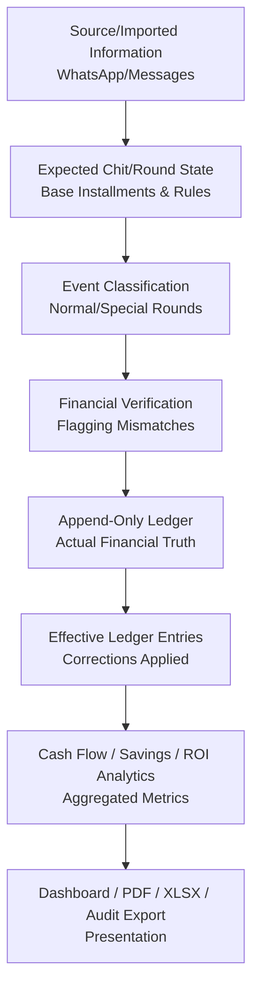

# Architecture & System Design

Chit Fund Analytics is designed around a strict separation of concerns, enforcing a unidirectional flow of financial truth from raw unstructured source data to a verified append-only ledger.

## High-Level Data Flow

## System Boundaries

### 1. Source Data (`source_messages`)
The original unstructured or semi-structured data received from chit managers (e.g., WhatsApp messages detailing auction outcomes, payments required, dividends, and thallu). This data is preserved permanently for audit purposes. Raw text is immutable after insert.

### 2. Expected Values & Event Classification (`auction_events`)
The mathematical projection of how a chit *should* behave according to its base rules, combined with event classification:
- **`NORMAL`**: Standard auction months where dividends and expected payments are calculated using the base formula.
- **`SPECIAL_NO_AUCTION`**: Months where no auction occurred (e.g., festive months) but payments are still collected. These are explicitly excluded from standard formula checks.
- **`UNKNOWN`**: Unclassifiable or incomplete data.

### 3. Verified Financial State
The reconciliation point between Source Data and Expected Values. Discrepancies (e.g., rounding errors in dividends, missing auction dates, or unknown winners) trigger strict calculation statuses:
- `INDUSTRY_DEFAULT`
- `VERIFIED_FORMULA`
- `FLAGGED_MISMATCH`
- `CONFIRM_SOURCE`
- `MANUAL_OVERRIDE`

### 4. Actual Ledger Transactions (`ledger_entries`)
The absolute financial truth of the application.
- Modeled as an **Append-Only Ledger**.
- Mistakes are not deleted; they are *superseded* by a new correction entry via `corrects_entry_id`.
- The `SPECIAL_NO_AUCTION` flag handles unique months where no auction occurred without breaking chronological or mathematical integrity.
- **Amount sign convention:** negative = we paid out, positive = we received.

### 5. Analytics & Presentation
The derived state read by the UI and exports.
- **ROI (Return on Investment):** Strictly guarded. ROI is only calculated if the chit has reached maturity and all prior rounds are fully verified and resolved.
- **Installment Savings:** Tracks the difference between the base installment amount and the actual required payment for that month (due to dividends).
- **Active Cash Flow:** Presents the real-time financial commitments required based only on verified, non-superseded ledger entries.

## Database Schema Highlights

The application uses Supabase PostgreSQL with Row Level Security (RLS) enforcing isolation per authenticated user (`profile_id`).

Key tables:
- **`chits`**: The scheme configuration (face value, base installment, duration).
- **`source_messages`**: Immutable raw WhatsApp/text messages.
- **`auction_events`**: The classified monthly events and calculation statuses.
- **`ledger_entries`**: The append-only financial ledger.

## Application Architecture

- **Frontend:** Next.js 16 (App Router), React 19, TypeScript, Tailwind CSS v4.
- **Backend/Database:** Supabase PostgreSQL, Supabase Auth.
- **Testing:** Vitest for domain logic, Next.js testing conventions.
- **Deployment:** Vercel.

The logic is heavily concentrated in TypeScript domain modules (e.g., `src/lib/ledger`, `src/lib/financial`) which are isolated and thoroughly tested independent of React components.
